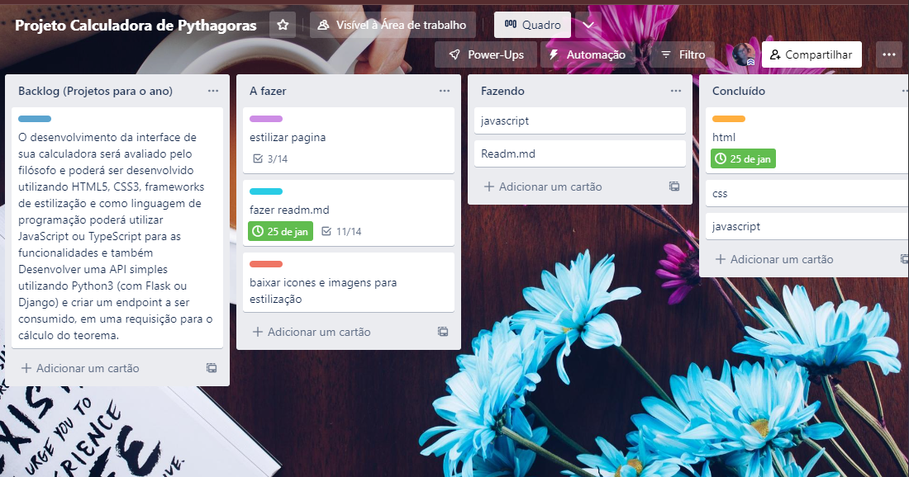

## Desafio-teorema-pitagoras

Este projeto é um desafio feito para testar uma calculadora que será capaz de calcular a relação entre os lados de um triângulo retângulo, conhecido popularmente como Teorema de Pitágoras.

Link da Aplicação

## 1. Planejamento

Trello

## 2. Tecnologias Utilizadas

## agradecimentos

Este é um desafio proposto pela empresa CROMAI, obrigado pela oportunidade em desenvolver esse projeto que seguira disponivel em meu github.

  <h3 align="center">Vanessa Borges</h3>
  

     
  

    

     
  

  

